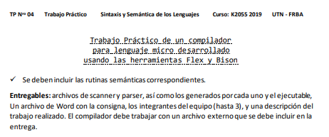

 

* *Para correr tests:* 'compilador.exe tests/pruebaX.txt'

### Palabras reservadas
* ESCRIBIR Variable Valor: Declarar variable
* LEER Variable: Imprime por pantalla el valor

### Operadores
* Asignacion: :=
* Suma +
* Resta 

### Observaciones
* Por enunciado, no existe declaracion de variables
* Toda variable por defecto tiene valor 0